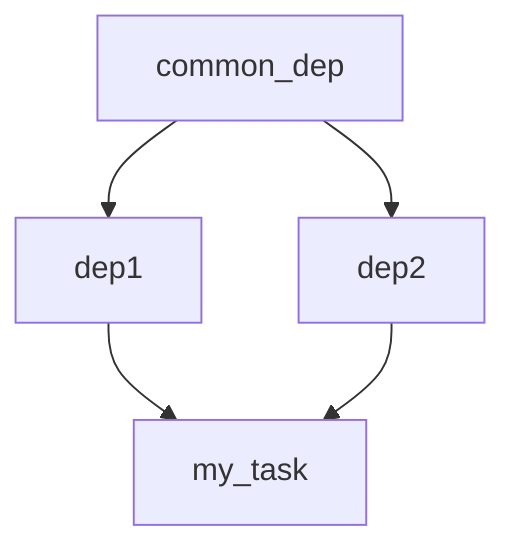
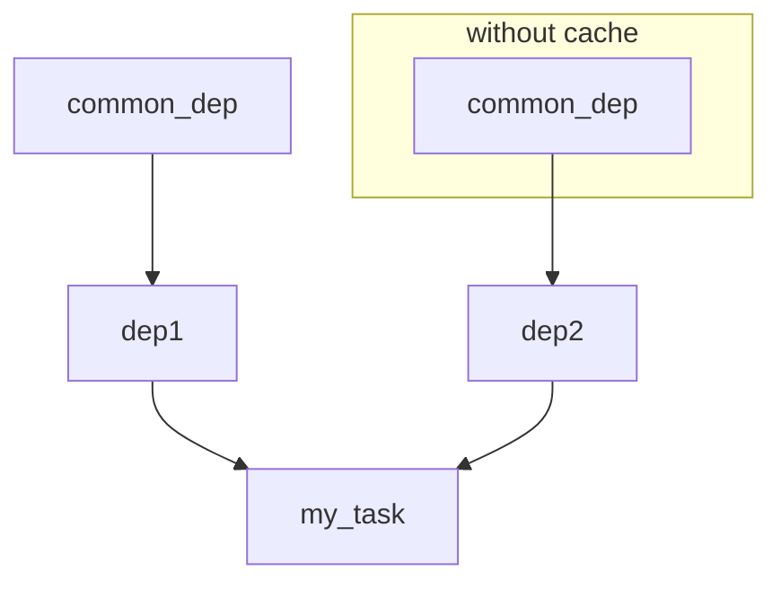

# State and Dependencies

## State

The `TaskiqState` is a global variable where you can keep the variables you want to use later.
For example, you want to open a database connection pool at a broker's startup.

This can be achieved by adding event handlers.

You can use one of these events:

- `WORKER_STARTUP`
- `CLIENT_STARTUP`
- `WORKER_SHUTDOWN`
- `CLIENT_SHUTDOWN`

Worker events are called when you start listening to the broker messages using taskiq.
Client events are called when you call the `startup` method of your broker from your code.

This is an example of code using event handlers:

::: tabs

@tab Annotated 3.10+

@[code python](../examples/state/events_example_annot.py)

@tab default values

@[code python](../examples/state/events_example.py)

:::

::: tip Cool tip!

If you want to add handlers programmatically, you can use the `broker.add_event_handler` function.

:::

As you can see in this example, this worker will initialize the Redis pool at the startup.
You can access the state from the context.

## Dependencies

Using context directly is nice, but this way you won't get code-completion.

That's why we suggest you try TaskiqDependencies. The implementation is very similar to FastApi's dependencies. You can use classes, functions, and generators as dependencies.

We use the [taskiq-dependencies](https://pypi.org/project/taskiq-dependencies/) package to provide autocompletion.
You can easily integrate it in your own project.

### How dependencies are useful

You can use dependencies for better autocompletion and reduce the amount of code you write.
Since the state is generic, we cannot guess the types of the state fields.
Dependencies can be annotated with type hints and therefore provide better auto-completion.

Let's assume that you've stored a Redis connection pool in the state as in the example above.

```python
@broker.on_event(TaskiqEvents.WORKER_STARTUP)
async def startup(state: TaskiqState) -> None:
    # Here we store connection pool on startup for later use.
    state.redis = ConnectionPool.from_url("redis://localhost/1")

```

You can access this variable by using the current execution context directly, like this:

::: tabs

@tab Annotated 3.10+

```python
from typing import Annotated

@broker.task
async def my_task(context: Annotated[Context, TaskiqDepends()]) -> None:
    async with Redis(connection_pool=context.state.redis, decode_responses=True) as redis:
        await redis.set('key', 'value')
```

@tab default values

```python
@broker.task
async def my_task(context: Context = TaskiqDepends()) -> None:
    async with Redis(connection_pool=context.state.redis, decode_responses=True) as redis:
        await redis.set('key', 'value')
```

:::

If you hit the `TAB` button after the `context.state.` expression, your IDE won't give you any auto-completion.
But we can create a dependency function to add auto-completion.

::: tabs

@tab Annotated 3.10+

```python
from typing import Annotated

def redis_dep(context: Annotated[Context, TaskiqDepends()]) -> Redis:
    return Redis(connection_pool=context.state.redis, decode_responses=True)

@broker.task
async def my_task(redis: Annotated[Redis, TaskiqDepends(redis_dep)]) -> None:
    await redis.set('key', 'value')

```

@tab default values

```python

def redis_dep(context: Context = TaskiqDepends()) -> Redis:
    return Redis(connection_pool=context.state.redis, decode_responses=True)

@broker.task
async def my_task(redis: Redis = TaskiqDepends(redis_dep)) -> None:
    await redis.set('key', 'value')

```

:::

Now, this dependency injection will be autocompleted. But, of course, state fields cannot be autocompleted,
even in dependencies. But this way, you won't make any typos while writing tasks.

### How do dependencies work

We build a graph of dependencies on startup. If the parameter of the function has
the default value of `TaskiqDepends` this parameter will be treated as a dependency.

Dependencies can also depend on something. Also dependencies are optimized to **not** evaluate things many times.

For example:

::: tabs

@tab Annotated 3.10+

@[code python](../examples/state/dependencies_tree_annot.py)

@tab default values

@[code python](../examples/state/dependencies_tree.py)

:::

In this code, the dependency `common_dep` is going to be evaluated only once and the `dep1` and the `dep2` are going to receive the same value. You can control this behavior by using the `use_cache=False` parameter to your dependency. This parameter will force the
dependency to reevaluate all its subdependencies.

In this example we cannot predict the result, since the `dep2` doesn't use cache for the `common_dep` function.
::: tabs

@tab Annotated 3.10+

@[code python](../examples/state/no_cache_annot.py)

@tab default values

@[code python](../examples/state/no_cache.py)

:::


The graph for cached dependencies looks like this:


```mermaid
graph TD
    A[common_dep]
    B[dep1]
    C[dep2]
    D[my_task]
    A --> B
    A --> C
    B --> D
    C --> D
```

The dependencies graph for `my_task` where `dep2` doesn't use cached value for `common_dep` looks like this:


```mermaid
graph TD
    A[common_dep]
    B[dep1]
    D[my_task]
    C[dep2]
    subgraph without cache
        A1[common_dep]
    end
    A --> B
    A1 --> C
    B --> D
    C --> D
```

### Class as a dependency

You can use classes as dependencies, and they can also use other dependencies too.

Let's see an example:

::: tabs

@tab Annotated 3.10+

@[code python](../examples/state/class_dependency_annot.py)

@tab default values

@[code python](../examples/state/class_dependency.py)

:::

As you can see, the dependency for `my_task` function is declared with `TaskiqDependency()`.
It's because you can omit the class if it's declared in type-hint for the parameter. This feature doesn't
work with dependency functions, it's only for classes.

You can pass dependencies for classes in the constructor.

### Generator dependencies

Generator dependencies are used to perform startup before task execution and teardown after the task execution.

::: tabs

@tab Annotated 3.10+

@[code python](../examples/state/generator_deps_annot.py)

@tab default values

@[code python](../examples/state/generator_deps.py)

:::


In this example, we can do something at startup before the execution and at shutdown after the task is completed.

If you want to do something asynchronously, convert this function to an asynchronous generator. Like this:

::: tabs

@tab Annotated 3.10+

@[code python](../examples/state/async_generator_deps_annot.py)

@tab default values

@[code python](../examples/state/async_generator_deps.py)

:::


#### Exception handling

Generator dependencies can handle exceptions that happen in tasks. This feature is handy if you want your system to be more atomic.

For example, if you open a database transaction in your dependency and want to commit it only if the function you execute is completed successfully.

::: tabs

@tab Annotated 3.10+


```python
from typing import Annotated

async def get_transaction(
    db_driver: Annotated[DBDriver, TaskiqDepends(get_driver)],
) -> AsyncGenerator[Transaction, None]:
    trans = db_driver.begin_transaction():
    try:
        # Here we give transaction to our dependent function.
        yield trans
    # If exception was found in dependent function,
    # we rollback our transaction.
    except Exception:
        await trans.rollback()
        return
    # Here we commit if everything is fine.
    await trans.commit()
```

@tab default values

```python
async def get_transaction(
    db_driver: DBDriver = TaskiqDepends(get_driver),
) -> AsyncGenerator[Transaction, None]:
    trans = db_driver.begin_transaction():
    try:
        # Here we give transaction to our dependent function.
        yield trans
    # If exception was found in dependent function,
    # we rollback our transaction.
    except Exception:
        await trans.rollback()
        return
    # Here we commit if everything is fine.
    await trans.commit()
```

:::


If you don't want to propagate exceptions in dependencies, you can add `--no-propagate-errors` option to `worker` command.

```bash
taskiq worker my_file:broker --no-propagate-errors
```

In this case, no exception will ever be propagated to any dependency.

## Progress tracking

Sometimes a task runs for a long time and you want to report how far it has progressed, so other parts of your system
(e.g. a web handler polling for status) can display it.

Taskiq provides a `ProgressTracker` dependency for this. It's not a method on `Context`, it's a dependency, just like
anything else built with `taskiq-dependencies`. It grabs the current `task_id` from the context for you and stores
progress using your broker's result backend.

::: tabs

@tab Annotated 3.10+

@[code python](../examples/state/progress_tracker_annot.py)

@tab default values

@[code python](../examples/state/progress_tracker.py)

:::

You can read the progress back from anywhere that has access to the `AsyncTaskiqTask` returned by `kiq`:

```python
task = await my_task.kiq()

progress = await task.get_progress()
if progress is not None:
    print(progress.state, progress.meta)
```

`state` can be one of the `TaskState` enum values (`STARTED`, `SUCCESS`, `FAILURE`, `RETRY`) or any custom string.
`meta` is generic (`ProgressTracker[MetaType]`) and can be any value your result backend can serialize, such as a plain
string, a `dict`, or a pydantic model. If you call `set_progress` without `meta`, the previously stored `meta` value is
preserved, which is handy when you only want to update `state`.

::: warning important note

`set_progress`/`get_progress` are no-ops by default on `AsyncResultBackend`. Make sure the result backend you use
actually implements progress storage (`InMemoryBroker`'s built-in backend does), before relying on this in production.

:::

## Generics

Taskiq supports generic dependencies. You can create a generic class that is generic over
another class and taskiq will be able to resolve generics based on type annotations.

### Default dependencies

By default taskiq has only two dependencies:

- Context from `taskiq.context.Context`
- TaskiqState from `taskiq.state.TaskiqState`


### Adding first-level dependencies

You can expand the default list of available dependencies for your application.
Taskiq has the ability to add new first-level dependencies using brokers.

The AsyncBroker interface has a function called `add_dependency_context` and you can add
more default dependencies to the taskiq. This may be useful for libraries if you want to
add new dependencies to users.
